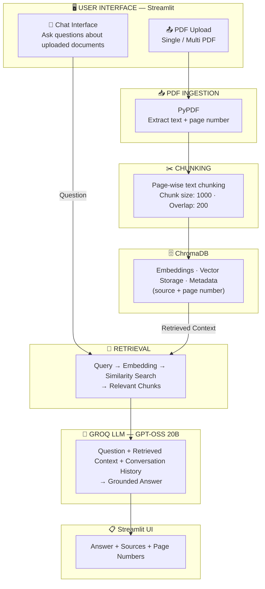
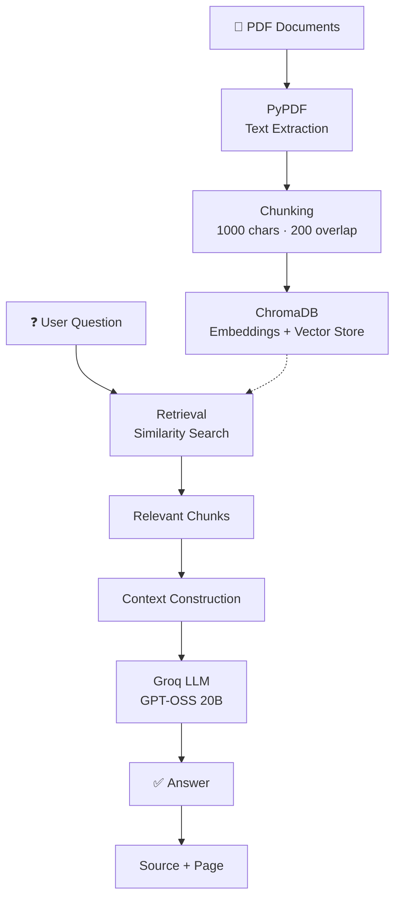
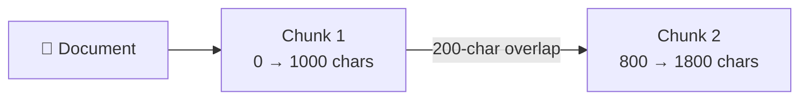
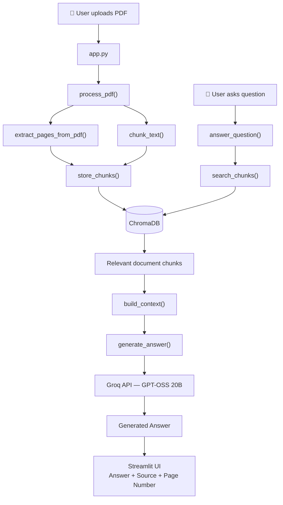

# 📚 PDF RAG Assistant

A simple Retrieval-Augmented Generation (RAG) application for asking questions about PDF documents — built with **Streamlit**, **PyPDF**, **ChromaDB**, and **Groq**.

Upload one or more PDFs, ask questions in a chat interface, and get grounded answers with the exact source document and page number cited.

---

## Table of Contents

- [Features](#features)
- [Architecture Overview](#architecture-overview)
- [RAG Pipeline](#rag-pipeline)
- [Components Used](#components-used)
- [How the Application Works](#how-the-application-works)
- [Project Structure](#project-structure)
- [Setup & Running](#setup--running)
- [Using the Application](#using-the-application)
- [ChromaDB Storage](#chromadb-storage)
- [Known Limitations](#known-limitations)

---

## Features

- 📄 Upload single or multiple PDF documents
- 💬 Chat-style Q&A over your uploaded documents
- 🔍 Semantic search powered by ChromaDB
- 📌 Every answer includes its source file and page number
- 🧠 Conversation history maintained during a session
- ⚡ Fast inference via Groq's `openai/gpt-oss-20b`

---

## Architecture Overview



---

## RAG Pipeline

The application follows a complete Retrieval-Augmented Generation pipeline:



---

## Components Used

| Component | Technology | Purpose |
|---|---|---|
| PDF Extraction | `PyPDF` | Extract text from PDF documents |
| Text Processing | Custom Python | Clean and split extracted text |
| Embeddings | ChromaDB embedding function | Convert text into vector representations |
| Vector Database | `ChromaDB` | Store and retrieve document chunks |
| Retrieval | ChromaDB similarity search | Find relevant chunks for a question |
| LLM | `openai/gpt-oss-20b` (via Groq) | Generate answers using retrieved context |
| UI | `Streamlit` | Interactive document upload and chat interface |
| Configuration | `python-dotenv` | Secure API key management |

---

## How the Application Works

### Stage 1 — PDF Upload
The user uploads one or more PDF documents through the Streamlit sidebar (e.g. `research-paper.pdf`, `agriculture-policy.pdf`, `government-report.pdf`). Multiple documents can live in the same ChromaDB collection, each remaining identifiable through metadata.

### Stage 2 — PDF Text Extraction
`PyPDF` reads the PDF page by page. For every page, the app stores the **page number** alongside the **extracted text**, so retrieved information can later be traced back to its source.

### Stage 3 — Text Chunking
Large documents are split into overlapping chunks:

- **Chunk size:** 1000 characters
- **Overlap:** 200 characters



The overlap reduces the chance of important information being cut exactly at a chunk boundary.

### Stage 4 — Embedding & Vector Storage
Each chunk is embedded and stored in ChromaDB along with metadata, e.g.:

```json
{
  "source": "research-paper.pdf",
  "page": 12
}
```

This vector representation lets semantically similar text be found even when the wording differs.

### Stage 5 — User Question
The user asks a question through the chat interface, e.g. *"What is institutional theory?"*

### Stage 6 — Semantic Retrieval
ChromaDB compares the question against stored embeddings and returns the most relevant chunks (up to 5 by default), each linked to its source page.

### Stage 7 — Context Construction
Retrieved chunks are combined into a single context block, tagged with their source and page number, and paired with the user's question.

### Stage 8 — LLM Generation
The context and question are sent to **Groq's `openai/gpt-oss-20b`**. The model is instructed to answer using only the supplied document context — if the answer isn't in the retrieved context, it responds:

> "I couldn't find that information in the uploaded documents."

### Stage 9 — Source Display
The app keeps the source metadata for every retrieved chunk and displays it alongside the generated answer.

---

## Project Structure

```
simple-rag/
├── app.py              # Streamlit user interface
├── rag.py              # Complete RAG pipeline
├── requirements.txt    # Python dependencies
├── README.md           # Project documentation
├── .env.example        # API key configuration template
├── .gitignore          # Files excluded from Git
├── test_pdf.py         # PDF extraction test
└── test_groq.py        # Groq API connection test
```

**`app.py`** — the Streamlit application layer: PDF upload, multi-document selection, processing controls, progress bar, chat interface, conversation history, source display, database clearing.

**`rag.py`** — the core RAG implementation: PDF extraction, page tracking, text chunking, ChromaDB storage, similarity retrieval, context construction, Groq LLM calls, answer generation, source tracking, database management.

**`test_pdf.py`** — verifies PDF text extraction works correctly.

**`test_groq.py`** — verifies the Groq API connection and selected model work correctly.

### RAG Pipeline — Step by Step

| Stage | Component | What Happens |
|---|---|---|
| 1 | Streamlit | User uploads PDF documents |
| 2 | PyPDF | Text is extracted page by page |
| 3 | Chunking | Text is divided into overlapping chunks |
| 4 | ChromaDB | Chunks are embedded and stored |
| 5 | User | User submits a question |
| 6 | ChromaDB | Relevant chunks are retrieved |
| 7 | Context Builder | Retrieved chunks are combined |
| 8 | Groq | Context and question are sent to the LLM |
| 9 | GPT-OSS 20B | Generates a grounded answer |
| 10 | Streamlit | Answer and sources are displayed |

### How It All Connects



---

## Setup & Running

### Prerequisites

- Python 3.10+
- Git
- A [Groq API key](https://console.groq.com)

### 1. Clone the Repository

```bash
git clone https://github.com/kavinila05/PDF-RAG-Assistant.git
cd PDF-RAG-Assistant
```

### 2. Create a Virtual Environment

```bash
python -m venv venv
```

Activate it:

```bash
# Windows
venv\Scripts\activate

# macOS / Linux
source venv/bin/activate
```

### 3. Install Dependencies

```bash
pip install -r requirements.txt
```

### 4. Configure the Groq API Key

Create a `.env` file in the project root (use `.env.example` as a template) and add:

```
GROQ_API_KEY=your_groq_api_key_here
```

### 5. Start the Application

```bash
streamlit run app.py
```

---

## Using the Application

**Upload Documents** — Upload one or more PDF files from the sidebar.

**Process Documents** — Click **"Process uploaded PDFs"**. The app will read the PDF → extract text → create chunks → generate embeddings → store chunks in ChromaDB.

**Ask Questions** — After processing, ask questions through the chat interface, e.g. *"What is institutional theory?"* The app retrieves relevant chunks before generating an answer.

**Follow-up Questions** — Conversation history is maintained during the Streamlit session:

```
User:      What is institutional theory?
Assistant: ...

User:      What are its main characteristics?
Assistant: ...
```

---

## ChromaDB Storage

The application uses ChromaDB as its local vector database, stored in a `chroma_db/` directory. This directory is intentionally excluded from Git — when someone else clones the repo, they build their own vector store by uploading their own documents.

---

## Known Limitations

1. **Scanned PDFs** — Currently works with PDFs containing selectable text only. Image-only/scanned PDFs need OCR (planned for a future version).
2. **Character-Based Chunking** — Chunking uses character boundaries and doesn't yet understand paragraphs, section headings, tables, or semantic boundaries.
3. **Retrieval** — Uses semantic similarity retrieval only. Future improvements could include hybrid (keyword + vector) search, reranking, metadata filtering, and multi-query retrieval.
4. **Follow-up Question Retrieval** — Conversation history is passed to the LLM, but retrieval currently runs on the raw current question. A future version could rewrite *"What are its characteristics?"* into *"What are the characteristics of institutional theory?"* before querying ChromaDB.
5. **Local Vector Database** — Currently uses a local ChromaDB instance. A production deployment could use a hosted or persistent vector database depending on scale.
