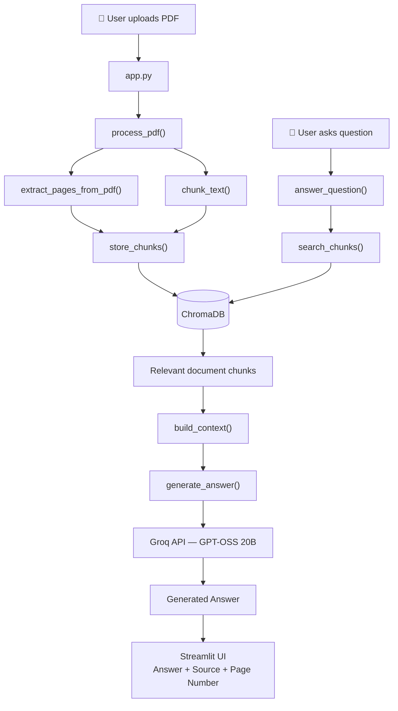

# 📚 Document RAG Assistant

**A document question-answering application built from the core RAG components — PDF ingestion, page-aware chunking, ChromaDB retrieval, context construction, and Groq LLM generation.**

The application allows users to upload multiple PDF documents, retrieve relevant information using semantic search, and generate grounded answers using a Groq-hosted LLM.

The RAG pipeline is implemented directly using **ChromaDB, PyPDF, Streamlit, Groq, and Python**, without high-level frameworks such as LangChain or LlamaIndex.

The purpose of the project is to understand how a document-based AI system works internally — from document ingestion and chunking to vector retrieval, context construction, prompt grounding, and answer generatio

------------------------------------------------------------------------

## Architecture Overview

```text
┌──────────────────────────────────────────────────────────────┐
│                         USER INTERFACE                       │
│                                                              │
│                     Streamlit Web UI                         │
│                                                              │
│   ┌──────────────────┐          ┌────────────────────────┐   │
│   │   PDF Upload     │          │    Chat Interface      │   │
│   │                  │          │                        │   │
│   │  Single / Multi  │          │  Ask questions about   │   │
│   │      PDF         │          │  uploaded documents    │   │
│   └────────┬─────────┘          └───────────┬────────────┘   │
└────────────┼────────────────────────────────┼────────────────┘
             │                                │
             │                                │ Question
             ▼                                ▼
┌────────────────────────┐        ┌───────────────────────────┐
│      PDF INGESTION     │        │       RETRIEVAL           │
│                        │        │                           │
│        PyPDF           │        │        ChromaDB           │
│                        │        │                           │
│  Extract text/page     │        │  Query → Embedding        │
│  information           │        │        ↓                  │
└───────────┬────────────┘        │  Similarity Search        │
            │                     │        ↓                  │
            ▼                     │  Relevant Chunks          │
┌────────────────────────┐        └─────────────┬─────────────┘
│      CHUNKING          │                      │
│                        │                      │
│  Page-wise text        │                      │
│  chunking              │                      │
│                        │                      │
│  Chunk Size: 1000      │                      │
│  Overlap: 200          │                      │
└───────────┬────────────┘                      │
            │                                   │
            ▼                                   │
┌────────────────────────┐                      │
│       ChromaDB         │◄─────────────────────┘
│                        │
│  Embeddings            │
│  Vector Storage        │
│  Metadata              │
│                        │
│  Source + Page Number  │
└───────────┬────────────┘
            │
            │ Retrieved Context
            ▼
┌──────────────────────────────────────────────────────────────┐
│                         GROQ LLM                             │
│                                                              │
│                     GPT-OSS 20B                              │
│                                                              │
│  Question + Retrieved Context + Conversation History         │
│                         ↓                                    │
│                    Grounded Answer                           │
└──────────────────────────┬───────────────────────────────────┘
                           │
                           ▼
                  ┌──────────────────┐
                  │   Streamlit UI   │
                  │                  │
                  │ Answer + Sources │
                  │ + Page Numbers   │
                  └──────────────────┘
```
------------------------------------------------------------------------

## RAG Pipeline

``` text
                    ┌─────────────────────┐
                    │    Upload PDF(s)    │
                    └──────────┬──────────┘
                               │
                               ▼
                    ┌─────────────────────┐
                    |        PyPDF        |
                    |                     |
                    │   Extract PDF Text  │
                    │      page-wise      │
                    └──────────┬──────────┘
                               │
                               ▼
                    ┌─────────────────────┐
                    │     Chunk Text      │
                    │  1000 chars/chunk   │
                    │   200-char overlap  │
                    └──────────┬──────────┘
                               │
                               ▼
                    ┌─────────────────────┐
                    │      ChromaDB       │
                    │ Embeddings & Vector │
                    │       Storage       │
                    └──────────┬──────────┘
                               │
                        User Question
                               │
                               ▼
                    ┌─────────────────────┐
                    │ Semantic Retrieval  │
                    │ Top relevant chunks │
                    └──────────┬──────────┘
                               │
                               ▼
                    ┌─────────────────────┐
                    │   Build Context     │
                    │ text + source/page  │
                    └──────────┬──────────┘
                               │
                               ▼
                    ┌─────────────────────┐
                    │      Groq LLM       │
                    │ openai/gpt-oss-20b  │
                    └──────────┬──────────┘
                               │
                               ▼
                    ┌─────────────────────┐
                    │ Grounded Answer +   │
                    │      Sources        │
                    └─────────────────────┘
```

### Step-by-step

1.  **PDF upload** --- The user selects one or more PDFs from the
    Streamlit sidebar.
2.  **Text extraction** --- `pypdf.PdfReader` extracts readable text
    page by page.
3.  **Chunking** --- Each page is divided into chunks of 1000 characters
    with 200 characters of overlap.
4.  **Metadata creation** --- Every chunk retains its source filename
    and page number.
5.  **Vector storage** --- Chunks and metadata are added to the
    persistent ChromaDB collection named `pdf_documents`.
6.  **Question retrieval** --- A user question is used to query ChromaDB
    for the most relevant chunks. The current application requests up to
    5 results.
7.  **Context construction** --- Retrieved text is combined with source
    and page metadata.
8.  **LLM generation** --- The question, retrieved context, and
    available chat history are sent to `openai/gpt-oss-20b` through
    Groq.
9.  **Grounded response** --- The prompt explicitly instructs the model
    to use only the supplied document context and to say when the
    requested information cannot be found.
10. **Source display** --- The Streamlit UI displays the retrieved
    source document(s) and page number(s).

------------------------------------------------------------------------

## 🛠️ Tech Stack

| Component | Technology | Responsibility |
|---------|------------|----------------|
|  Document Processing | PyPDF | Extract text from uploaded PDFs |
|  Chunking Engine | Custom Python | Create overlapping chunks |
|  Embeddings | ChromaDB Embedding Function | Convert text into vectors |
|  Vector Database | ChromaDB | Store and retrieve chunks |
|  Retrieval Engine | Semantic Similarity Search | Find relevant document context |
|  LLM Provider | Groq | Fast inference |
|  Language Model | GPT OSS 20B | Generate grounded answers |
|  Frontend | Streamlit | Interactive user interface |
|  Configuration | python-dotenv | Environment variable management |

------------------------------------------------------------------------

## How the Application Works 

**Stage 1 — PDF Upload**

The user uploads one or more PDF documents through the Streamlit interface.

Example:
research-paper.pdf
agriculture-policy.pdf
government-report.pdf
Multiple documents can be stored in the same ChromaDB collection.

Each document remains identifiable through metadata.

**Stage 2 — PDF Text Extraction**

PyPDF reads the PDF page by page.

For every page, the application stores:
Page Number
     +
Extracted Text

Example:

Page: 12

Institutional theory explains how organizations
are influenced by rules, norms and institutions...
Preserving the page number allows the application to later show where retrieved information came from.

**Stage 3 — Text Chunking**

Large documents are divided into smaller pieces called **chunks**.

The current implementation uses:

| Parameter | Value |
|---|---:|
| Chunk Size | 1000 characters |
| Overlap | 200 characters |


                              DOCUMENT
                                │
                                ▼
                  ┌──────────────────────────┐
                  │         Chunk 1          │
                  │                          │
                  │    0 → 1000 characters   │
                  └────────────┬─────────────┘
                               │
                               │
                          200 characters
                            overlap
                               │
                               ▼
                   ┌──────────────────────────┐
                   │         Chunk 2          │
                   │                          │
                   │   800 → 1800 characters  │
                   └──────────────────────────┘

The 200-character overlap reduces the possibility of important information being split exactly at a chunk boundary.

**Stage 4 — Embedding and Vector Storage**
Each chunk is stored in ChromaDB.

Conceptually:
Text
 ↓
Embedding Model
 ↓
Vector
 ↓
ChromaDB
The vector representation allows semantically similar pieces of text to be found even when the wording is different.

Each stored chunk also contains metadata:
Example:
{
    source: "research-paper.pdf",
    page: 12
}

**Stage 5 — User Question**

The user asks a question through the chat interface.

For example:What is institutional theory?

The question is passed to ChromaDB for retrieval.

**Stage 6 — Semantic Retrieval**

ChromaDB compares the question against the stored document embeddings.

The application retrieves the most relevant chunks.
Question
   │
   ▼
ChromaDB
   │
   ├── Chunk 17 → Page 8
   ├── Chunk 23 → Page 12
   ├── Chunk 31 → Page 15
   ├── Chunk 42 → Page 21
   └── Chunk 48 → Page 24
   The current application retrieves up to 5 relevant chunks.

   **Stage 7 — Context Construction**

The retrieved chunks are combined into a context that is passed to the LLM.

Conceptually:
DOCUMENT CONTEXT

Source: research-paper.pdf
Page: 12

Institutional theory explains...

Source: research-paper.pdf
Page: 15

Institutions influence organizational behavior...

USER QUESTION

What is institutional theory?

**Stage 8 — LLM Generation**

The context and user question are sent to:
Groq
  ↓
openai/gpt-oss-20b

Groq
  ↓
openai/gpt-oss-20b
The model is instructed to answer using the supplied document context rather than inventing information.

If the retrieved context does not contain the answer, the application instructs the model to say:I couldn't find that information in the uploaded documents.

**Stage 9 — Source Display**

The application keeps the source metadata associated with every retrieved chunk.


## 📁 Project Structure

``` text
document-rag-assistant/
│
├── app.py                 # Streamlit user interface
├── rag.py                 # Core RAG pipeline
├── requirements.txt       # Python dependencies
├── .env                   # Local secrets (DO NOT commit)
├── .env.example           # Environment-variable template
├── .gitignore             # Git ignore rules
│
├── chroma_db/             # Local persistent ChromaDB data
├── venv/                  # Local virtual environment
├── __pycache__/           # Python bytecode cache
│
├── test_groq.py           # Simple Groq connectivity/model test
├── test_pdf.py            # Development PDF/RAG test script
├── sample.pdf             # Local sample document used during development
└── README.md              # Project documentation
```
------------------------------------------------------------------------

### How It All Connects



------------------------------------------------------------------------

## ⚙️ Installation and Setup

### Prerequisites

- Python 3.10+
- Git
- A [Groq API key](https://console.groq.com)

### 1. Clone the Repository

```bash
git clone https://github.com/kavinila05/PDF-RAG-Assistant.git
cd PDF-RAG-Assistant
```

### 2. Create a Virtual Environment

```bash
python -m venv venv
```

Activate it:

```bash
# Windows
venv\Scripts\activate

# macOS / Linux
source venv/bin/activate
```

### 3. Install Dependencies

```bash
pip install -r requirements.txt
```

### 4. Configure the Groq API Key

Create a `.env` file in the project root (use `.env.example` as a template) and add:

```
GROQ_API_KEY=your_groq_api_key_here
```

### 5. Start the Application

```bash
streamlit run app.py
```


Streamlit will start the application and provide a local URL, commonly:

``` text
http://localhost:8501
```

------------------------------------------------------------------------

## 🚀 How to Use

1.  Start the Streamlit application.
2.  Use **Upload PDF files** in the sidebar to select one or more PDFs.
3.  Confirm the selected documents displayed in the main area.
4.  Click **Process uploaded PDFs**.
5.  Wait for extraction, chunking, and storage to complete.
6.  Check the **Stored chunks** metric in the sidebar.
7.  Enter a question in the chat input.
8.  The system retrieves relevant chunks and generates an answer from
    the document context.
9.  Expand **📚 Sources** to inspect the source PDF and page number.
10. Use **Clear database** when you want to delete the stored ChromaDB
    collection and reset the current chat/session state.

### Example

``` text
User:
What is institutional theory?

Assistant:
[Answer generated from the retrieved PDF context]

Sources:
document_name.pdf — Page 9
```

------------------------------------------------------------------------

## 🧪 Development Tests

### Test Groq connectivity

`test_groq.py` provides a simple API/model check by asking the
configured model to explain RAG in one sentence.

Run:

``` bash
python test_groq.py
```
------------------------------------------------------------------------

### PDF/RAG test script
```

`test_pdf.py` was used as a development test for the PDF/RAG flow.

**Note:** the current `rag.py` API has evolved to page-aware processing
with functions such as `process_pdf()`, and `answer_question()` returns
both the answer and sources. If you keep `test_pdf.py` in the public
repository, update it to match the current API before presenting it as
an automated test.

```
------------------------------------------------------------------------

## 📌 Recommended `.env.example`

``` env
# Obtain a Groq API key and place the real value in your local .env file.
GROQ_API_KEY=your_groq_api_key_here
```

------------------------------------------------------------------------

## ChromaDB Storage

The application uses ChromaDB as its local vector database, stored in a `chroma_db/` directory. This directory is intentionally excluded from Git — when someone else clones the repo, they build their own vector store by uploading their own documents.

------------------------------------------------------------------------

## Known Limitations

1. **Scanned PDFs** — Currently works with PDFs containing selectable text only. Image-only/scanned PDFs need OCR (planned for a future version).
2. **Character-Based Chunking** — Chunking uses character boundaries and doesn't yet understand paragraphs, section headings, tables, or semantic boundaries.
3. **Retrieval** — Uses semantic similarity retrieval only. Future improvements could include hybrid (keyword + vector) search, reranking, metadata filtering, and multi-query retrieval.
4. **Follow-up Question Retrieval** — Conversation history is passed to the LLM, but retrieval currently runs on the raw current question. A future version could rewrite *"What are its characteristics?"* into *"What are the characteristics of institutional theory?"* before querying ChromaDB.
5. **Local Vector Database** — Currently uses a local ChromaDB instance. A production deployment could use a hosted or persistent vector database depending on scale.
------------------------------------------------------------------------


## 👤 Author

**Kavinila V**

Built as a hands-on implementation of a document-question-answering
system using Retrieval-Augmented Generation.

------------------------------------------------------------------------

